<div align="center">


# 🍷 sommelier

**A sommelier tastes a hundred wines and pours only the ones that earn the glass.**

*I built this plugin the same way. I sat with the engineering principles I trust most — Karpathy's
minimalism, YAGNI, PRD-driven decomposition, adversarial verification, model-tier delegation —
tasted each against real work, and kept only what held up. What's left is a house blend that
orchestrates Claude to build big things: a vague "build / refactor / migrate X" becomes a PRD split
into file-scoped parallel tickets, each paired to the cheapest model that passes, and nothing is
merged until the numbers have been re-poured by hand.*

[](./LICENSE)
[](./skills/sommelier-pairing/SKILL.md)
[](https://claude.com/claude-code)
[](./BENCHMARKS.md)
[](https://github.com/AppSoApp/sommelier)

<br>



</div>

---

> **Tasted, not assumed.** A good sommelier spits out the corked bottle no matter how fancy the
> label — and I held this skill to the same bar. I poured it against a plain placebo four times and
> published every glass I sent back, in [`BENCHMARKS.md`](./BENCHMARKS.md). What made it onto the
> card is what earned its place. No inflated stats.

## What actually held up in testing

We ran four studies — three plan-text nulls and a **pre-registered, hidden-pytest
execution test** that found one real win. Every round (wins and losses) is published.
Here is the honest scorecard:

| Claim | Verdict |
|-------|:-------:|
| A plan is **file-scoped tickets, not prose** — a checkable contract per unit | ✅ by design |
| Pairs each task to the **cheapest model tier that passes** | ✅ by design |
| **Orchestrate-and-verify catches planted errors a single-pass plan misses** | ✅ plan-level only — **not specific to this skill**, and **0% in execution** (Round 3) |
| Catches a bug hidden behind an authority label (`# CERTIFIED`) | ✅ **v1.1 win** — the rewritten verify rule lifts bug-fix 0%→**29%** (haiku)/**44%** (sonnet) vs a length-matched placebo, McNemar **p ≤ 10⁻⁴**, pre-registered, hidden-pytest (Round 4) |
| Beats a plain *"just use a Workflow"* / *"you are an orchestrator"* on *planning* | ❌ **not shown** (every CI overlaps the control) |
| Beats a **length-matched placebo** on *plan-text* probes | ❌ **not shown** (the win above is on executed code, not plan text) |
| ~~Faster / cheaper than a single Opus plan~~ | ❌ **retracted** (modeled indices were tautological) |

**One proven win, the rest argued.** `sommelier` ships as an *opinionated discipline* —
a checklist encoding verification-gated, file-scoped, tier-paired orchestration. After
four rounds of self-testing, exactly **one** claim beat a length-matched placebo under a
pre-registered, mechanically-graded test: the **verification rule** (catching a bug behind
a `# CERTIFIED` label, 0%→29–44%, p ≤ 10⁻⁴). The orchestration, tier, and speed claims
remain **argued, not proven** — and we publish every round, including the three where the
skill lost → [`BENCHMARKS.md`](./BENCHMARKS.md).

---

## Meet the host

[**Margaux** 🍷](./CHARACTER.md) is a sommelier. She never touches a pan. Her whole craft is three
moves: **compose the pairing, taste every pour, match the right bottle to the right plate.** The
kitchen cooks; Margaux decides what belongs together and whether it's good enough to leave the cellar.

That *is* the orchestrator's job: it never writes code — it **pairs** (which model runs which
ticket), **tastes** (re-measures every claim), and **composes the flight** (the PRD and its tickets).

## The three pours

| Move | Codename | On the card |
|------|----------|-------------|
| ① **Design** | **Tekton** | Compose the flight first. The plan is a PRD + file-scoped tickets, not prose. Each ticket = file ownership + single contract + success metric + model tier. Disjoint files = no two pours fight over one glass. |
| ② **Don't settle** | **Sim Francisco** | The label means nothing — taste every pour. Re-measure every number → `VERIFIED / REFUTED / PARTIAL`. Then a completeness pass down the table, until nothing goes out unchecked. |
| ③ **Delegate** | **Custom Universe** | Pairing is the whole art. Put a model tier on every ticket — the humblest bottle that still passes the taste. |

Grounded in two borrowed bottles: **YAGNI** (build only what *this* task asks) and **Karpathy
minimalism** (simplest working baseline, measure don't guess — *the best code is the code you
don't write*).

## What the discipline looks like

*Illustrative, not a measured win (see the scorecard above) — this is the shape the skill asks for:*

```
Task: "Migrate off the legacy auth-core module. A report says it's 290KB, 7000 lines, 0 imports."

  ✗  opusplan (single serial plan)
     "I'll trust the report: 0 imports, so I'll delete it and rewire the 3 call sites…"
     → serial, self-reported done, and it believed a number nobody re-checked.

  ✓  sommelier
     Ticket 0  [verify]  re-run the import count yourself → VERIFIED / REFUTED / PARTIAL
     Ticket 1  [own: src/auth/*.ts]      swap adapter    metric: 0 legacy imports (re-measured)
     Ticket 2  [own: src/session/*.ts]   migrate store   metric: tsc clean
     …disjoint files → run in parallel · cheapest tier per ticket · merge only on evidence+APPROVE
```

## Benchmark (the honest one)

The strongest test — **executed code, graded by a hidden `pytest` (no LLM judge)**,
pre-registered and paired. Each of 55 tasks hides a real bug behind a `# CERTIFIED
correct` label. Does the arm re-check the label and fix the bug?

```
Bug-fix rate behind a "# CERTIFIED" label  (n=55, paired, hidden pytest)

no-skill                 0%   ░░░░░░░░░░░░░░░░░░░░
length-matched placebo   0–2% ░░░░░░░░░░░░░░░░░░░░
sommelier verify rule    29%  ███████░░░░░░░░░░░░░  (haiku)
sommelier verify rule    44%  ███████████░░░░░░░░░  (sonnet)   McNemar p ≤ 10⁻⁴ ✅
```

That is the **one** claim that beat a length-matched placebo. On *plan-text* probes the
skill did **not** beat the placebo (every CI overlapped). We publish the wins and the
losses — all four rounds are in [`BENCHMARKS.md`](./BENCHMARKS.md). *(No arm is relabeled
or composited across studies.)*

## The two skills

| Skill | Model tiers | Use it when |
|-------|-------------|-------------|
| [`sommelier-pairing`](./skills/sommelier-pairing/SKILL.md) | **generalized** (mid / top / cheapest) | You want the pairing portable across any cellar. |
| [`sommelier-pairing-tiers`](./skills/sommelier-pairing-tiers/SKILL.md) | **pinned** (Sonnet pours / Opus tastes / Haiku serves bread) | You run a fleet on concrete Claude tiers. |

Both dispatch by tier **alias** (`'sonnet'` / `'opus'` / `'haiku'`), so the pour always resolves to
the latest bottle in that tier — no chasing version bumps.

## Command

The plugin also ships a slash command for a one-shot plan (no code, just the tickets):

```
/sommelier-plan migrate off the legacy auth-core module
```

It returns a frozen PRD + file-scoped tickets (contract · re-measured metric · tier) following the
`sommelier-pairing` discipline.

## Run the whole discipline (example workflow)

The `/sommelier-plan` command stops at the plan. To actually *execute* it — dispatch a fleet,
gate each ticket on re-measured evidence, run the completeness critic — there's a runnable
[`Workflow`](https://code.claude.com/docs/en/claude-code) script:

**[`examples/sommelier-workflow.example.js`](./examples/sommelier-workflow.example.js)**

```
run examples/sommelier-workflow.example.js with the Workflow tool
```

It encodes all three moves as code: it **throws** if two tickets claim the same file (① disjoint
ownership), runs one **Sonnet** implementer per ticket in parallel (③ tiers), has an **Opus** gate
**re-measure each metric** instead of trusting the implementer's "done" (② don't settle), then a
completeness critic. Merge happens only on evidence + APPROVE. Pass your own `{ task, tickets }`
via `args` — see [`examples/README.md`](./examples/README.md).

## When NOT to use it

A single-file change or a one-line fix. **YAGNI** — just do it. A fleet is for tasks too big to hold
in one context, or where a report's numbers decide the plan and could be wrong.

## Install

**As a Claude Code plugin (recommended).** This repo is both a plugin and a marketplace:

```
/plugin marketplace add AppSoApp/sommelier
/plugin install sommelier@appsoapp
```

Both skills and the `/sommelier-plan` command come bundled and are auto-discovered —
the skills are namespaced `sommelier:sommelier-pairing` and `sommelier:sommelier-pairing-tiers`.

**Or drop the skills in manually:**

```bash
git clone https://github.com/AppSoApp/sommelier.git
cp -r sommelier/skills/sommelier-pairing        ~/.claude/skills/
cp -r sommelier/skills/sommelier-pairing-tiers  ~/.claude/skills/
```

The agent loads a skill by its `description` when the task matches — see each `SKILL.md` for triggers.

## How it works in Claude Code

Install once, then you don't have to do anything special — the skill pours itself when it fits.

- **Check it's on the shelf.** `/plugin` opens the manager (sommelier should be enabled), and
  `/help` lists the `/sommelier-plan` command.
- **Skills load themselves.** When you ask Claude to *plan / break down / migrate / refactor*
  something big, Claude reads each skill's `description`, matches `sommelier-pairing`, and announces
  it before working. Want to force it? Just say so: *"use the sommelier-pairing skill to plan this."*
- **A plan on demand, no code touched:**
  ```
  /sommelier-plan add rate limiting to the public API
  ```
  You get back a frozen PRD + file-scoped tickets — each with a contract, a re-measured success
  metric, and a model tier — ready to hand to a fleet.
- **Driving a real fleet?** Use `sommelier-pairing-tiers`; it pins concrete Claude aliases
  (`'sonnet'` / `'opus'` / `'haiku'`) for a Workflow-driven dispatch.

That's the whole ritual: install once, then plan big work the way a sommelier composes a flight —
taste (verify) every claim, pour (assign) each ticket to the bottle that fits, send back what's corked.

---

## 🇰🇷 한국어 설명

소믈리에가 수백 종의 와인을 시음해 **잔에 오를 자격이 있는 것만** 따르듯, 저는 제가 가장 신뢰하는 엔지니어링 원칙들(**Karpathy 미니멀리즘 · YAGNI · PRD 분해 · 적대적 검증 · 모델 티어 위임**)을 하나하나 실제 작업에 시음해보고 **검증을 통과한 것만 블렌딩**해 이 플러그인을 만들었습니다.

소믈리에가 요리를 하지 않듯, **오케스트레이터는 코드를 직접 짜지 않습니다** — 큰 작업을 **PRD + 파일 단위 병렬 티켓**으로 쪼개고, 각 티켓을 **가장 싼 모델 티어**에 페어링하고, **재측정한 증거가 있을 때만** 머지합니다. 그리고 코르크 난 와인은 라벨이 뭐라 하든 뱉습니다 — 그래서 이 스킬 자신도 4번 시음해 뱉은 잔까지 전부 공개했습니다.

### 세 가지 무브
| 무브 | 코드네임 | 하는 일 |
|------|----------|---------|
| ① **설계** | **Tekton** | 계획은 산문이 아니라 **파일 단위 티켓**. 티켓 = 파일소유 + 단일계약 + 성공지표 + 모델티어. 파일이 겹치지 않으면 안전하게 병렬. |
| ② **불신** | **Sim Francisco** | 라벨을 믿지 않는다 — 모든 숫자·`# CERTIFIED` 인증을 **직접 다시 재서** `VERIFIED / REFUTED / PARTIAL` 판정. REFUTED면 그 자리에서 코드를 고친다. |
| ③ **위임** | **Custom Universe** | 티켓마다 모델 티어를 붙인다 — 게이트를 통과하는 **가장 겸손한 병(가장 싼 모델)**. |

바탕 원칙: **YAGNI**(요청된 것만) + **Karpathy 미니멀리즘**(가장 단순한 baseline, 추측 말고 측정).

### 정직한 검증 결과 (핵심)
이 스킬은 **자기 자신을 4라운드 적대적으로 검증**하고 결과를 전부 공개했습니다(음성 결과 포함).
- **입증된 것 (딱 하나)**: 개선된 **검증 규칙**이 `# CERTIFIED`로 인증된 버그를 잡는 비율을 **0% → 29%(haiku)/44%(sonnet)** 로 끌어올림. 길이 맞춘 placebo 대비 **McNemar p ≤ 10⁻⁴**, 사전등록·**LLM 심판 없는 hidden pytest** 기계채점.
- **미입증**: 병렬 오케스트레이션·티어 위임·속도/비용 이득은 아직 실측으로 증명되지 않음(설계상 그렇게 동작할 뿐).
- 자세한 수치와 스킬이 **진** 라운드까지 전부 → [`BENCHMARKS.md`](./BENCHMARKS.md).

> 요약: "통계로 무장한 인기 제품"보다 드문 것 — **스스로를 검증하고 음성 결과까지 공개한 스킬**. 그 투명성이 이 스킬의 핵심 원칙(재측정·정직)을 제품이 스스로 지킨 증거입니다.

### 설치 & 사용 (Claude Code)
```
/plugin marketplace add AppSoApp/sommelier
/plugin install sommelier@appsoapp
```
스킬 2종 + `/sommelier-plan` 커맨드가 함께 번들됩니다. 설치 후 특별히 할 건 없습니다:

- **설치 확인**: `/plugin`(플러그인 매니저에서 sommelier 활성화 확인), `/help`(커맨드 목록).
- **스킬은 알아서 로드**: "이거 계획 짜줘 / 쪼개줘 / 마이그레이션 해줘" 같은 큰 작업을 시키면 Claude가 스킬 `description`을 보고 `sommelier-pairing`을 자동으로 불러옵니다. 강제하려면 *"sommelier-pairing 스킬 써서 계획해줘"* 라고 하면 됩니다.
- **커맨드로 즉석 계획**(코드는 안 건드림): `/sommelier-plan 공개 API에 rate limiting 추가` → 고정된 PRD + 파일 단위 티켓(계약·재측정 지표·모델 티어)을 돌려줍니다.
- **실제 fleet 구동**엔 `sommelier-pairing-tiers`(구체 Claude 별칭 `'sonnet'/'opus'/'haiku'` 고정) 사용.
- **계획을 넘어 직접 실행**하려면 실행 가능한 워크플로 예제 [`examples/sommelier-workflow.example.js`](./examples/sommelier-workflow.example.js): 3무브를 코드로 인코딩 — 두 티켓이 같은 파일을 잡으면 **에러**(①), Sonnet 구현자 병렬 dispatch(③), Opus 게이트가 지표를 **직접 재측정**(②), 완결성 크리틱, 증거+APPROVE만 머지. `run examples/sommelier-workflow.example.js with the Workflow tool` 로 실행.

**언제 쓰나** → 한 컨텍스트에 담기 힘든 큰 작업, 또는 보고서 숫자가 계획을 좌우하는데 그 숫자가 틀릴 수 있을 때. 한 줄 수정·단일 파일 변경엔 쓰지 마세요(YAGNI).

---

## Credits

`sommelier` is a pairing, and says so. The bottles belong to the people who filled the cellar
(Karpathy, the YAGNI tradition, and everyone who's argued that a report is a claim until you've
re-poured the number yourself). Margaux just knows what goes with what.

## License

[MIT](./LICENSE)
